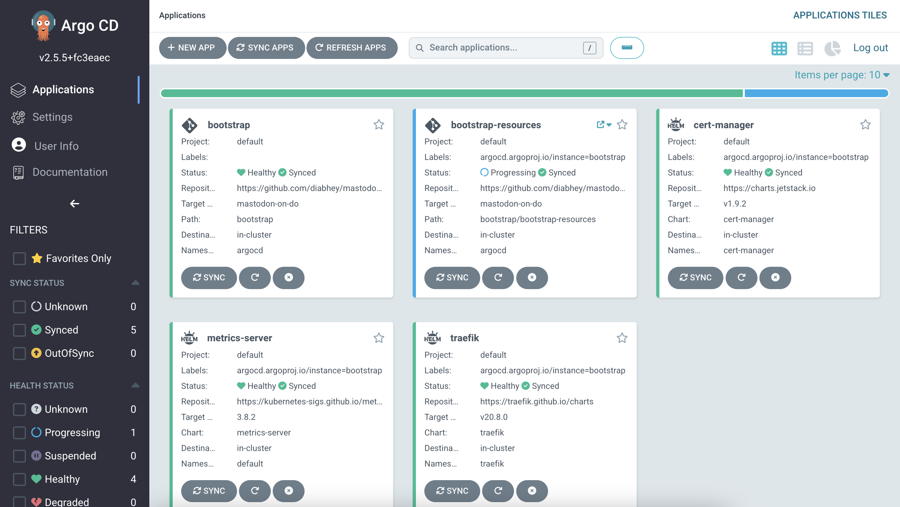

# Bootstrapping using Argo CD

## Overview

The bootstrapper leverages the ArgoCD's "App of Apps" pattern. Here we use Helm package management to achieve this.

```bash
# Directory structure
.
├── Chart.yaml # boiler plate chart.yaml
├── README.md 
├── bootstrap-resources # ingress/cluster issuer
├── bootstrap.yaml # parent app 
├── templates # child app templates (one file per app)
└── values.yaml # chart overrides: enable/diable apps
```

In this case, the parent app "**bootstrap**" is installed along with its *child apps* which are rendered from `templates/` and `bootstrap-resources/` directories.
By default, we have enabled most of the apps, but you can easily enable them by setting the flags in the [values.yaml](./values.yaml)

```yaml
# values.yaml
# Global Parameters (REQUIRED)
domain: ""
# Application specific
traefik:
  enable: true
```

> **Note:** Save changes to the file as deemed fit and push the changes to the git repository. The bootstrapper follows a strict GitOps workflow, so all the changes need to be pushed to git to reflect the changes in the Kubernetes cluster.

**Access the ArgoCD Web UI**

```bash
# Get the argo password
kubectl -n argocd get secret argocd-initial-admin-secret -o jsonpath="{.data.password}" | base64 -d; echo
# Expose the argocd-server and login with the credentials on localhost:8080
kubectl -n argocd port-forward svc/argocd-server 8080:80
# Open the browser and go to localhost:8080 to access Argo CD UI
# Login with username: `admin,` password: `paste the value from the previous step.`
```


