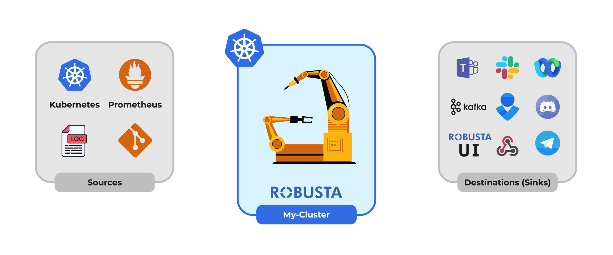
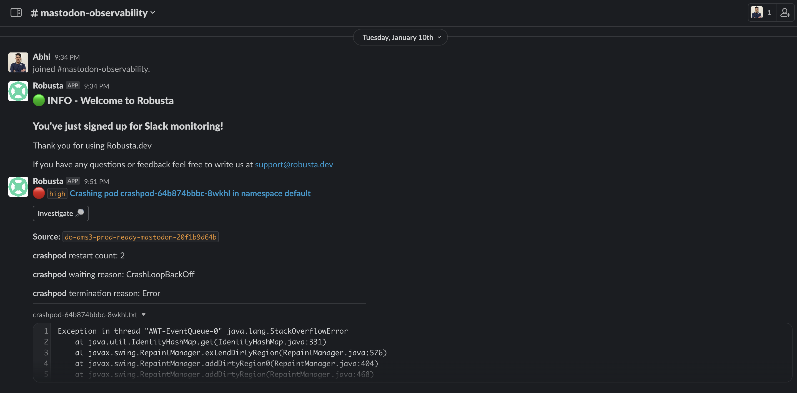

# Set up Observability Stack using Robusta

[Robusta](https://github.com/robusta-dev/robusta) is open source Kubernetes monitoring, troubleshooting, and automation platform which comes pre-baked with
- Embedded Prometheus stack with pre-configured alerts
- A web UI to see all alerts, changes, and events in your cluster
- Multi-cluster observability



## Installation

1. Install the python cli:

    ```commandline
    python3 -m pip install -U robusta-cli --no-cache
    ```

2. Generate a values file for Helm:
    ```bash
    # An interactive session where you can configure sinks such as receiving the alerts to a particular slack channel, etc. 

    robusta gen-config
    ```

3. Install Robusta with Helm:
    ```commandline
    helm repo add robusta https://robusta-charts.storage.googleapis.com && helm repo update
    helm install robusta robusta/robusta -f ./generated_values.yaml
    ```

    [Detailed instructions »](https://docs.robusta.dev/master/installation.html)

## Access Robusta Web UI

Upon successful installation, you will be taken to [https://platform.robusta.dev/](https://platform.robusta.dev/) where one can monitor the Kubernetes cluster.


**Slack integration**
